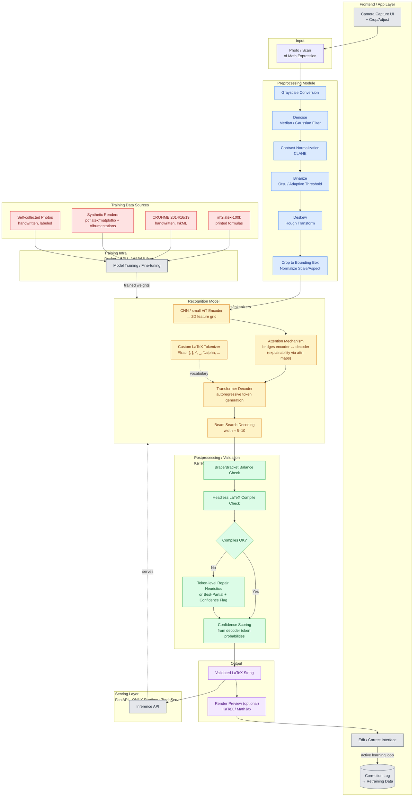

```mermaid
flowchart TB
    subgraph INPUT["Input"]
        IMG[Photo / Scan<br/>of Math Expression]
    end

    subgraph PRE["Preprocessing Module<br/>Python · OpenCV · NumPy"]
        P1[Grayscale Conversion]
        P2[Denoise<br/>Median / Gaussian Filter]
        P3[Contrast Normalization<br/>CLAHE]
        P4[Binarize<br/>Otsu / Adaptive Threshold]
        P5[Deskew<br/>Hough Transform]
        P6[Crop to Bounding Box<br/>Normalize Scale/Aspect]
        P1 --> P2 --> P3 --> P4 --> P5 --> P6
    end

    subgraph MODEL["Recognition Model<br/>PyTorch · HF transformers/tokenizers"]
        direction TB
        ENC["CNN / small ViT Encoder<br/>→ 2D feature grid"]
        ATT["Attention Mechanism<br/>bridges encoder ↔ decoder<br/>(explainability via attn maps)"]
        DEC["Transformer Decoder<br/>autoregressive token generation"]
        TOK["Custom LaTeX Tokenizer<br/>\\frac, {, }, ^, _, \\alpha, ..."]
        BEAM["Beam Search Decoding<br/>width ≈ 5–10"]
        ENC --> ATT --> DEC
        TOK -.vocabulary.-> DEC
        DEC --> BEAM
    end

    subgraph POST["Postprocessing / Validation<br/>KaTeX (headless) / matplotlib.mathtext"]
        V1[Brace/Bracket Balance Check]
        V2[Headless LaTeX Compile Check]
        V3{Compiles OK?}
        V4[Token-level Repair Heuristics<br/>or Best-Partial + Confidence Flag]
        V5[Confidence Scoring<br/>from decoder token probabilities]
        V1 --> V2 --> V3
        V3 -- No --> V4
        V3 -- Yes --> V5
        V4 --> V5
    end

    subgraph OUT["Output"]
        LATEX[Validated LaTeX String]
        PREVIEW["Render Preview (optional)<br/>KaTeX / MathJax"]
    end

    subgraph APP["Frontend / App Layer<br/>React Native / Flutter"]
        CAM[Camera Capture UI<br/>+ Crop/Adjust]
        EDIT[Edit / Correct Interface]
        LOG[(Correction Log<br/>→ Retraining Data)]
        CAM --> IMG
        PREVIEW --> EDIT
        EDIT -->|active learning loop| LOG
    end

    subgraph SERVE["Serving Layer<br/>FastAPI · ONNX Runtime / TorchServe"]
        API[Inference API]
    end

    subgraph DATA[" Training Data Sources"]
        D1[im2latex-100k<br/>printed formulas]
        D2[CROHME 2014/16/19<br/>handwritten, InkML]
        D3[Synthetic Renders<br/>pdflatex/matplotlib + Albumentations]
        D4[Self-collected Photos<br/>handwritten, labeled]
    end

    subgraph TRAIN["Training Infra<br/>Docker · GPU · W&B/MLflow"]
        TR[Model Training / Fine-tuning]
    end

    IMG --> P1
    P6 --> ENC
    BEAM --> V1
    V5 --> LATEX
    LATEX --> PREVIEW
    LATEX --> API
    API -.serves.-> MODEL

    D1 --> TR
    D2 --> TR
    D3 --> TR
    D4 --> TR
    TR -.trained weights.-> MODEL

    classDef preproc fill:#dbeafe,stroke:#3b82f6,color:#1e3a8a
    classDef model fill:#fef3c7,stroke:#d97706,color:#78350f
    classDef postproc fill:#dcfce7,stroke:#16a34a,color:#14532d
    classDef output fill:#f3e8ff,stroke:#9333ea,color:#581c87
    classDef data fill:#fee2e2,stroke:#dc2626,color:#7f1d1d
    classDef infra fill:#e5e7eb,stroke:#4b5563,color:#1f2937

    class P1,P2,P3,P4,P5,P6 preproc
    class ENC,ATT,DEC,TOK,BEAM model
    class V1,V2,V3,V4,V5 postproc
    class LATEX,PREVIEW output
    class D1,D2,D3,D4 data
    class API,TR,CAM,EDIT,LOG infra
```
